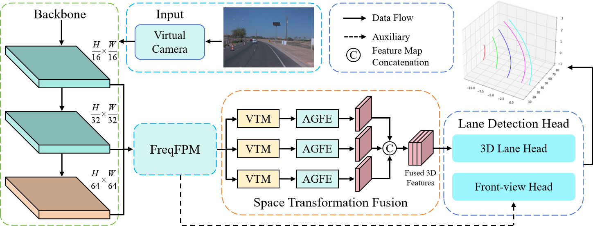
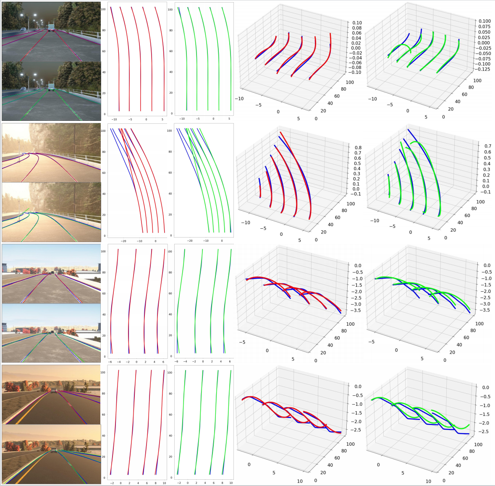
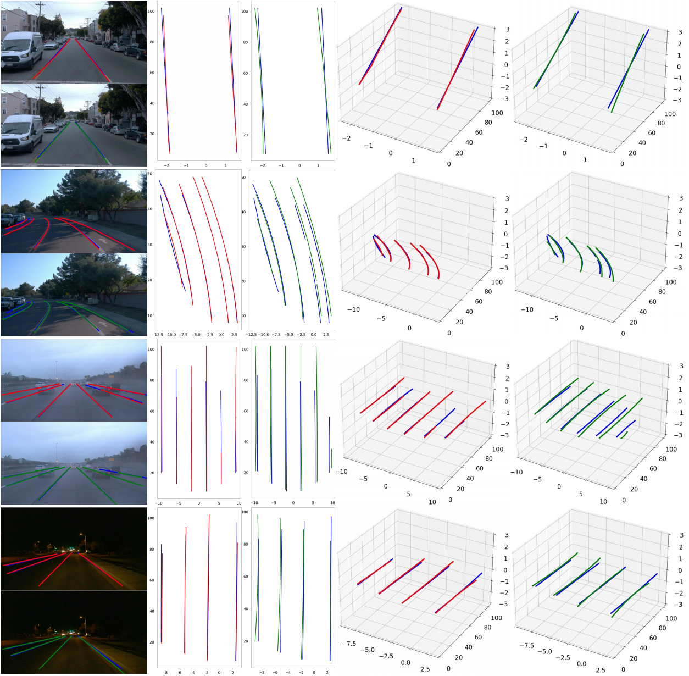

<br />
<p align="center">
  <h3 align="center"><strong>Freq-3DLane: 3D Lane Detection From Monocular Images via Frequency-Aware Feature Fusion</strong></h3>
</p>

This repo is the official PyTorch implementation for paper: [Freq-3DLane: 3D Lane Detection From Monocular Images via Frequency-Aware Feature Fusion](https://ieeexplore.ieee.org/abstract/document/10995224). 


In this paper, we present Freq-3DLane, a simple yet effective end-to-end 3D lane detection framework. Freq-3DLane performs 3D lane detection by fusing multi-scale information and leveraging the frequency characteristics of features to enhance perception. Additionally, we introduce an attention-guided spatial transform fusion module to further improve detection performance. Extensive experiments demonstrate that Freq-3DLane achieves impressive results. We believe that our work has the potential to make a positive contribution to society and lay the groundwork for future research advancements.

## News
- [2025/04/24] Freq-3DLane is accepted by IEEE Transactions on Intelligent Transportation Systems.
- [2025/04/24] Freq-3DLane has been published in the IEEE Transactions on Intelligent Transportation Systems with Early Access.
- [2025/09/16] Freq-3DLane has been officially published in the IEEE Transactions on Intelligent Transportation Systems.
- [2026/01/19] We have open-sourced the source code of Freq-3DLane.

## Installation
To run our code, make sure you are using a machine with at least one GPU. Setup the enviroment , follow these steps:

#### **Step 1.** Create a conda virtual environment and activate it
```
conda create -n freq3dlane python=3.9 -y
conda activate freq3dlane
conda install pytorch==1.10.0 torchvision==0.11.0 cudatoolkit=11.1 -c pytorch -y
pip install torch==1.10.0+cu111 torchvision==0.11.0+cu111 torchaudio==0.10.0 -f https://download.pytorch.org/whl/torch_stable.html
```

#### **Step 2.** Install Freq3DLane
```
git clone https://github.com/bijiping/Freq3DLane.git
cd Freq3DLane
pip install -r requirement.txt
```


## Data Preparation
- Please refer to [Apollo 3D Lane Synthetic](https://github.com/yuliangguo/3D_Lane_Synthetic_Dataset) for downloading Apollo 3D Lane Synthetic Dataset. For example: download OpenLane dataset to /Dataset/Apollosim
- Please refer to [OpenLane](https://github.com/OpenPerceptionX/OpenLane) for downloading OpenLane Dataset. For example: download OpenLane dataset to /Dataset/OpenLane

The data folders are organized as follows:
```
├── Dataset/
|   └── Apollosim
|       └── images/...
|       └── data_splits  
|           └── standard
|               └── train.json
|               └── test.json 
|           └── illus_chg/...
|           └── rare_subset/...
\
|   └── OpenLane
|       └── images/...
|       └── lane3d_1000
|           └── training/...
|           └── validation/...
|           └── test
|               └── up_down_case
|               └── curve_case
|               └── extreme_weather_case
|               └── night_case
|               └── intersection_case
|               └── merge_split_case
|               └── The corresponding 6 txt files...
```


## Pretrained Models
 All models are uploaded to [<span style="color: blue;">Baidu Drive: Click on the link below / Enter the website below</span>]

| Dataset | Pretrained | Metrics | website | filename |
|--------| - |--------| - |-----|
| Apollo | [Baidu Drive](https://pan.baidu.com/s/1KN9BiC9gY4AUjiorCb0Qhg?pwd=1234) | F1=98.4 | https://pan.baidu.com/s/1KN9BiC9gY4AUjiorCb0Qhg?pwd=1234 | freq3dlane_apollo.pth |
| OpenLane-1000 | [Baidu Drive](https://pan.baidu.com/s/1H5Dn8GKiLFUlIn5l0X-taA?pwd=1234) | F1=59.7 | https://pan.baidu.com/s/1H5Dn8GKiLFUlIn5l0X-taA?pwd=1234 | freq3dlane_openlane.pth |


### Training and evaluation on OpenLane
- Please refer to [OpenLane](https://github.com/OpenPerceptionX/OpenLane) for downloading OpenLane Dataset. For example: download OpenLane dataset to /dataset/openlane

- How to train:
    1. Please modify the configuration in the /tools/openlane_config.py
    2. Execute the following code:
```
cd tools
python train_openlane.py
```
- How to evaluation:
    1. Please modify the configuration in the /tools/val_openlane.py
    2. Execute the following code:
```
cd tools
python val_openlane.py
```

### Training and evaluation on Apollo 3D Lane Synthetic
- Please refer to [Apollo 3D Lane Synthetic](https://github.com/yuliangguo/3D_Lane_Synthetic_Dataset) for downloading Apollo 3D Lane Synthetic Dataset. For example: download OpenLane dataset to /dataset/apollo

- How to train:
    1. Please modify the configuration in the /tools/apollo_config.py
    2. Execute the following code:
```
cd tools
python train_apollo.py
```
- How to evaluation:
    1. Please modify the configuration in the /tools/val_apollo.py
    2. Execute the following code:
```
cd tools
python val_apollo.py
```


## Benchmark

### OpenLane1000

| Method          | F-Score | X error  near | X error far | Z error near | Z error far |
|-----------------|---------|---------------|-------------|--------------|-------------|
| 3DLaneNet       | 44.1    | 0.479         | 0.572       | 0.367        | 0.443       |
| GenLaneNet      | 32.3    | 0.591         | 0.684       | 0.411        | 0.521       |
| PersFormer      | 50.5    | 0.485         | 0.553       | 0.364        | 0.431       | 
| CurveFormer     | 50.5    | 0.340         | 0.772       | 0.207        | 0.651       |
| CurveFormer++   | 52.7    | 0.337         | 0.801       | 0.198        | 0.676       |
| Anchor3DLane    | 50.5    | 0.300         | 0.311       | 0.103        | 0.139       |
| BEV-LaneDet     | 58.4    | 0.309         | 0.659       | 0.244        | 0.631       | 
| **Freq-3DLane** | 59.7    | 0.265         | 0.665       | 0.196        | 0.608       | 


###  Apollo 3D Lane Synthetic (Balanced Scence)

| Method               | F-Score | X error  near | X error far | Z error near  | Z error far |
|----------------------|---------|---------------|-------------|---------------|-------------|
| 3D-LaneNet           | 86.4    | 0.068         | 0.477       | 0.015         | 0.202       |
| Gen-LaneNet          | 88.1    | 0.061         | 0.486       | 0.012         | 0.214       |
| CLGO                 | 91.9    | 0.061         | 0.361       | 0.029         | 0.250       |
| Reconstruct from Top | 91.9    | 0.049         | 0.387       | 0.008         | 0.213        |
| PersFormer           | 92.9    | 0.054         | 0.356       | 0.010         | 0.234       |
| CurveFormer          | 95.8    | 0.078         | 0.326       | 0.018         | 0.219       |
| Anchor3DLane         | 95.6    | 0.052         | 0.306       | 0.015         | 0.223       |
| BEV-LaneDet          | 96.9    | 0.016         | 0.242       | 0.020         | 0.216       | 
| **Freq-3DLane**      | 98.4    | 0.021         | 0.200       | 0.022         | 0.208       |


## Visualization
We represent the visualization results of Freq-3DLane on ApolloSim and OpenLane1000 datasets.

* Visualization results on ApolloSim dataset.


* Visualization results on OpenLane1000 dataset.



## Acknowledgment

This library is inspired by [BEVLaneDet](https://github.com/gigo-team/bev_lane_det), [FreqFusion](https://github.com/Linwei-Chen/FreqFusion), [Anchor3DLane](https://github.com/tusen-ai/Anchor3DLane), [LATR](https://github.com/JMoonr/LATR), [OpenLane](https://github.com/OpenDriveLab/PersFormer_3DLane),  [GenLaneNet](https://github.com/yuliangguo/Pytorch_Generalized_3D_Lane_Detection) and many other related works, we thank them for sharing the code and datasets.

# Citation
If you find this repo useful for your research, please cite
```
@ARTICLE{freq3dlane,
  author={Song, Yongchao and Bi, Jiping and Sun, Lijun and Liu, Zhaowei and Jiang, Yahong and Wang, Xuan},
  journal={IEEE Transactions on Intelligent Transportation Systems}, 
  title={Freq-3DLane: 3D Lane Detection From Monocular Images via Frequency-Aware Feature Fusion}, 
  year={2025},
  volume={26},
  number={9},
  pages={12974-12986},
  doi={10.1109/TITS.2025.3565272}}
```
